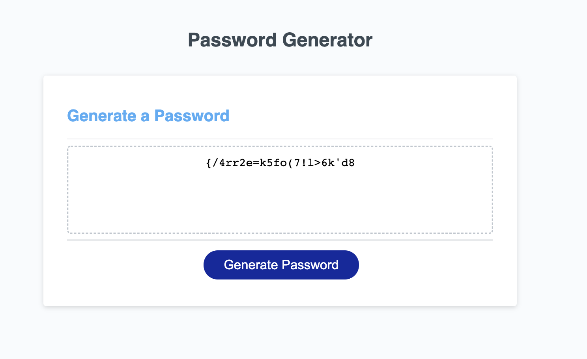

# Password Generator
  

## Table of Contents
  - [Description](#description)
  - [Installation](#installation)
  - [Built With](#built-with)
  - [License](#license)
  - [Questions](#questions)

## Description
An application that generates a random password based on user-selected criteria. This app will run in the browser and feature dynamically updated HTML and CSS powered by your JavaScript code. It will also feature a clean and polished user interface and be responsive, ensuring that it adapts to multiple screen sizes.

## Installation 
- Clone the GitHub repository
- Right click the file index.html and select "open with live server"

## Built With
- [VScode](https://code.visualstudio.com/) - Editor of choice

## License
MIT License
## Questions
- Github: https://github.com/Monicarangel95

